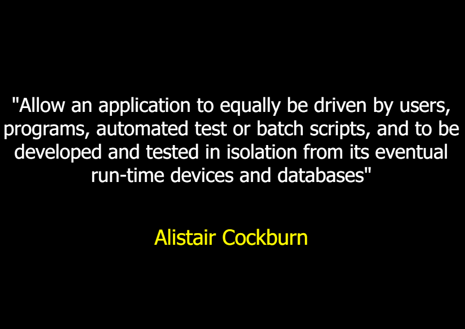
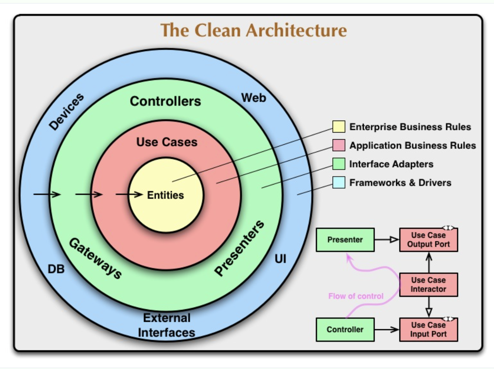

# Descrição:

Este projeto é uma API construída em TypeScript com Node.js, utilizando a Hexagonal Architecture, Clean Architecture e princípios de Clean Code.

## Anotaçoes e conceitos:

### Arquitetura
- Decisões que restringem a distribuição de responsabilidades que eu consigo fazer, ou seja, decisões que registringem o design.

### TDD

### Arquitetura Hexagonal

A arquitetura hexagonal, ou arquitetura ports and adapters, é um estilo de design de software que promove a separação entre a lógica de negócios e suas dependências externas, facilitando a manutenção e a testabilidade.

1. Foco nos Adaptadores: Divide o sistema em núcleo de aplicação (lógica de negócios) e adaptadores (interfaces com o mundo externo).
2. Comunicação Bidirecional: Usa portas e adaptadores para permitir a comunicação bidirecional entre o núcleo e o mundo externo.
3. lexibilidade em Troca de Tecnologias: Facilita a substituição de componentes externos (como bancos de dados e interfaces de usuário) sem impactar a lógica de negócios.

### Clean architecture

A Clean Architecture é um estilo de design de software que organiza o código em camadas concêntricas, com a lógica de negócios no centro e as interfaces externas nas camadas externas. Essa estrutura promove a separação de responsabilidades, facilitando a manutenção, a testabilidade e a escalabilidade do sistema.

1. Camadas Concêntricas: Organiza o sistema em camadas concêntricas, com a lógica de negócios no centro, seguida por casos de uso, interfaces e frameworks na camada externa.
2. Dependência de Regras de Negócio: As dependências sempre apontam para o centro (regras de negócios), mantendo o núcleo independente de detalhes externos.
- Uncle Bob: "Entidade é qualquer coisa que tenha regras de negócio independentes".
- Conceito de Entidade: Uncle Bob não definiu especificamente o que é uma entidade, mas podemos adotar o conceito do DDD, que inclui agregados, entidades e objetos de valor.
3. Estrutura Rígida de Camadas: Promove uma estrutura rígida onde cada camada tem uma responsabilidade específica, facilitando a compreensão e a manutenção do sistema.
4. Semelhança com Arquitetura Hexagonal: A partir dos casos de uso para cima, a Clean Architecture se assemelha à arquitetura hexagonal, pois ambas dependem de como a aplicação é guiada (driving, como controllers) e de como a aplicação guia os dispositivos de I/O (driven, como bancos de dados).

### Principais Diferenças

1. Estrutura e Organização: A arquitetura hexagonal é mais flexível e focada em adaptadores, enquanto a Clean Architecture usa uma estrutura mais rígida e em camadas concêntricas.
2. Comunicação: A arquitetura hexagonal facilita a comunicação bidirecional através de portas e adaptadores, enquanto a Clean Architecture direciona todas as dependências para o núcleo.
3. Abordagem: A arquitetura hexagonal é mais prática e focada na interação com componentes externos, enquanto a Clean Architecture é mais teórica e enfatiza a independência das regras de negócios.
4. Dependências de Camadas: Nas camadas externas da Clean Architecture, pode haver dependência do objeto de domínio, mas o contrário não pode ocorrer, uma característica que vem da Onion Architecture.

