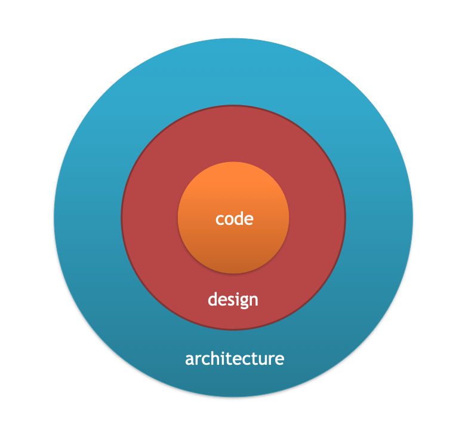
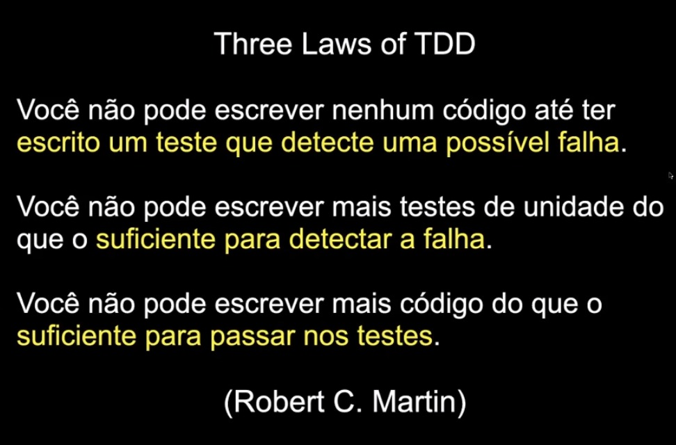
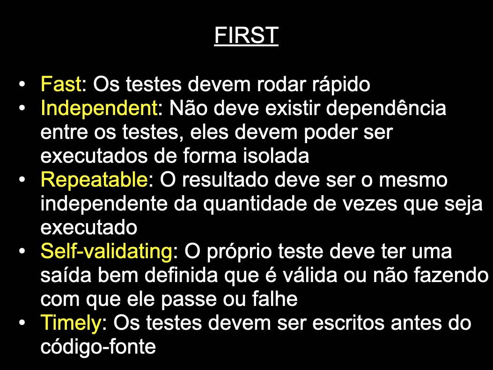
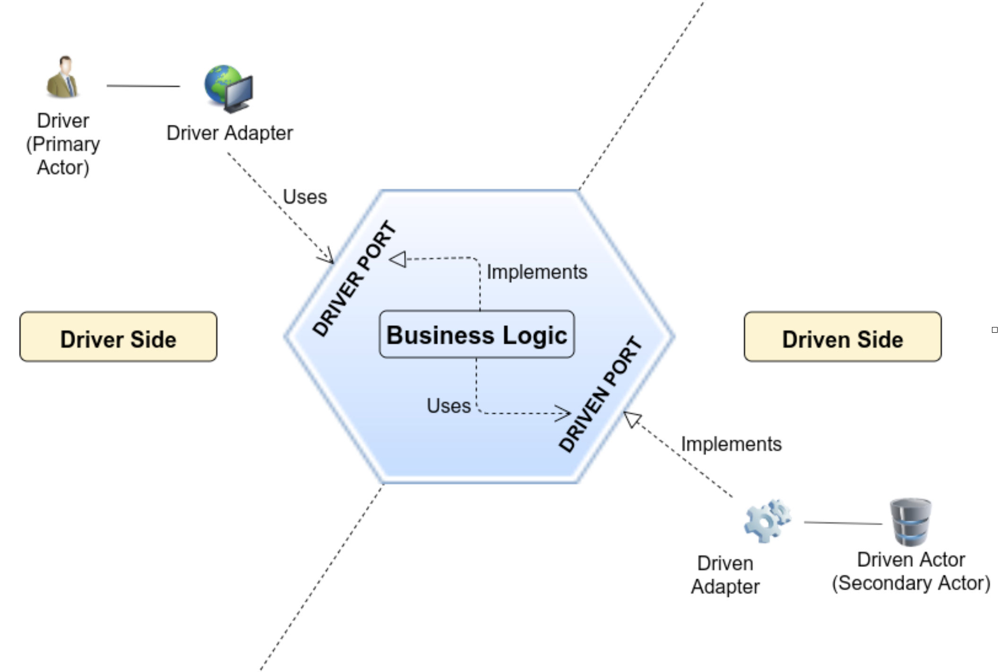

# Descrição:

Este projeto é uma API construída em TypeScript com Node.js, utilizando a Hexagonal Architecture, Clean Architecture e princípios de Clean Code.

## Anotaçoes e conceitos:

### Arquitetura
- Decisões que restringem a distribuição de responsabilidades que eu consigo fazer, ou seja, decisões que registringem o design.

### TDD

### Clean architecture

- A partir de usecases pra cima a clean arch é muito parecida com hexagonal pois temos uma dependencia de quem guia a aplicação e de como a aplicação guia os dispositivos de io (driving que sao os controllers, e driven que sao dbs)

- Uncle bob: "entidade é qualquer coisa que tenha regras de negocio independentes"
- Uncle bob nao definiu o que é uma entitie, mas a gente pode pegar um conceito do DDD que é o agregate, entity e value object:

- As camadas externas podem depender do objeto de dominio o contrario que nao pode acontecer (isso vem da onion)

